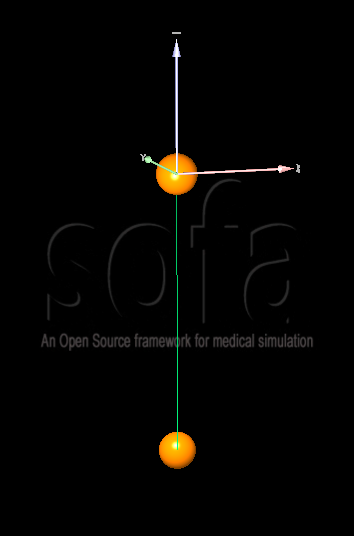
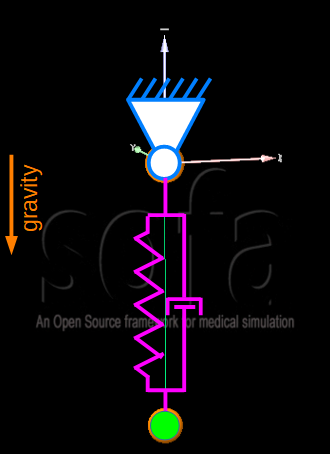

# 1D oscillator
In this example a one mass 1D oscillator is modeled.

## System/Model Parameters

**Mass**
- m = 1 *kg* = 1e-3 *t*

**Spring Stiffness**
- k = 10 *N/m* = 10-e3 *N/mm*

**Damping**
- d = 1 *Ns/m* = 1e-3*Ns/mmm*

**Gravity**
- g = 9.81 *m/s²* = 9.81e3 *mm/s²*

## Sets of Consistent Units
|SET #| MASS | LENGTH | TIME | FORCE | STRESS | ENERGY | DENSITY  | YOUNG's  | GRAVITY   | 
|-----|------|--------|------|-------|--------|--------|----------|----------|-----------|
|1    | kg   | m      | s    | N     | Pa     | J      | 7.85e+03 | 2.1e+11 | 9.81     |
|2    | ton  | mm     | s    | N     | MPa    | N-mm   | 7.85e-09 | 2.1e+05 | 9.81e+03 |

