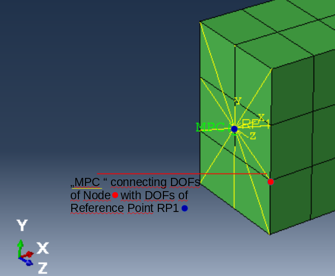

# Rotating beam (3D FEM)
In this example a rotating 3D continuum ("beam/rod") is modeled. 
The structure is discretized by linear solid hexader finite elements.

One end of the structure is constrained to one reference node, which is given a dynamic rotational boundary condition about an axis.

## System/Model Parameters

