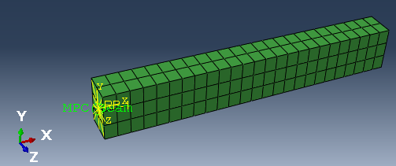

# SOFA Examples/Help Posts
This repository exist for making data available for certain questions and tasks concerning the usage of [SOFA] (https://www.sofa-framework.org).

# Consistent Units
| MASS      | LENGTH | TIME | FORCE     | STRESS     | ENERGY      | DENSITY  | YOUNG's  | 35MPH    56.33KMPH | GRAVITY   |
|-----------|--------|------|-----------|------------|-------------|----------|----------|--------------------|-----------|
| kg        | m      | s    | N         | Pa         | J           | 7.83e+03 | 2.07e+11 | 15.65              | 9.806     |
| kg        | cm     | s    | 1.0e-02 N |            |             | 7.83e-03 | 2.07e+09 | 1.56e+03           | 9.806e+02 |
| kg        | cm     | ms   | 1.0e+04 N |            |             | 7.83e-03 | 2.07e+03 | 1.56               | 9.806e-04 |
| kg        | cm     | us   | 1.0e+10 N |            |             | 7.83e-03 | 2.07e-03 | 1.56e-03           | 9.806e-10 |
| kg        | mm     | ms   | kN        | GPa        | kN-mm       | 7.83e-06 | 2.07e+02 | 15.65              | 9.806e-03 |
| g         | cm     | s    | dyne      | dyne/cm²   | erg         | 7.83e+00 | 2.07e+12 | 1.56e+03           | 9.806e+02 |
| g         | cm     | us   | 1.0e+07 N | Mbar       | 1.0e+07 Ncm | 7.83e+00 | 2.07e+00 | 1.56e-03           | 9.806e-10 |
| g         | mm     | s    | 1.0e-06 N | Pa         |             | 7.83e-03 | 2.07e+11 | 1.56e+04           | 9.806e+03 |
| g         | mm     | ms   | N         | MPa        | N-mm        | 7.83e-03 | 2.07e+05 | 15.65              | 9.806e-03 |
| ton       | mm     | s    | N         | MPa        | N-mm        | 7.83e-09 | 2.07e+05 | 1.56e+04           | 9.806e+03 |
| lbf-s²/in | in     | s    | lbf       | psi        | lbf-in      | 7.33e-04 | 3.00e+07 | 6.16e+02           | 386       |
| slug      | ft     | s    | lbf       | psf        | lbf-ft      | 1.52e+01 | 4.32e+09 | 51.33              | 32.17     |
|           |        |      |           |            |             |          |          |                    |           |
| kgf-s²/mm | mm     | s    | kgf       | kgf/mm²    | kgf-mm      | 7.98e-10 | 2.11e+04 | 1.56e+04           | 9.806e+03 |
| kg        | mm     | s    | mN        | 1.0e+03 Pa |             | 7.83e-06 | 2.07e+08 |                    | 9.806e+03 |
| g         | cm     | ms   | 1.0e+1 N  | 1.0e+05 Pa |             | 7.83e+00 | 2.07e+06 |                    | 9.806e-04 |

the table is from:
(https://www.dynasupport.com/howtos/general/consistent-units)
